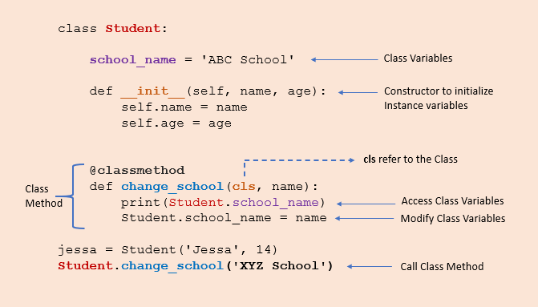

`class and static methods` are special types of methods that have different behaviours and use cases when compared to `regular instances methods`


## Regular/Instance method

these are bound to regular object instance. they can access and modify the object's state and can be called on an object instance. 

```
class Person:
    def __init__(self, name, age):
        # instance variables
        self.name = name
        self.age=age 

    # instance methods
    def get_name(self):
        return self.name

    # instance methods
    def get_age(self):
        return self.age

    # instance methods
    def set_name(self,newname):
        self.name = newname

    # instance methods
    def set_age(self, newage):
        self.age = newage


person1 = Person("Sunil", 30)   
print(person1.get_name())
print(person1.get_age())
person1.set_name("Kumar")
print(person1.get_name())
```

## Class Methods

class methods are bound to class itself and they can access only class variables. It can only allow to change the class variable state across all the class objects.

Class methods are used when we are dealing with factory methods. factory methods are those which returns the class object for different purposes.

They are always called using `ClassName.method_name()`



```
from datetime import date 

class Student:
    collage_name = "ABC Collage"
    def __init__(self,name,age):
        self.name = name
        self.age = age 

    @classmethod
    def calculate_age(cls,name,birthyear):
        # calulate age and set it as age, then 
        # return a new object
        return cls(name,date.today().year-birthyear)


    def show(self):
        print(f"{self.name} age is: {self.age} studying in colleage: {Student.collage_name}")


sunil = Student("Sunil",39)
sunil.show()
 
shiva=Student.calculate_age("Shiva",1983) # invoke a new clas
shiva.show()
```

Explanation of above code. 

- we created two objects, one using the constructor and the second using the `calculate_age()`
  
- The constructor takes two arguments name and age. On the other hand, class method takes cls, name, and birth_year and `returns a class instance which nothing but a new object`
  
- The `@classmethod` decorator is used for converting `calculate_age() method to a class method.`
  
- The `calculate_age()` method takes Student class (cls) as a first parameter and `returns constructor by calling Student(name, date.today().year - birthYear), which is equivalent to Student(name, age).`

### Access Class Variables in Class Methods

```
@classmethod
def change_collage(cls, newcollname):
    # change class variable
    cls.collage_name=newcollname

Student.change_collage("New coll")
sunil.show()
```

## Static Method

Any method we create in a class will automatically be created as an instance method. We must explicitly tell Python that it is a static method using the `@staticmethod`


```
class Student:
    @staticmethod
    def student_greeting(greeting_msg):
        print(f"Hello {greeting_msg}")


Student.student_greeting("Welcome Students !")

sunil=Student()
sunil.student_greeting('Welcome Sunil !')
```

```
class Employee:
    def __init__(self,name,project_name):
        self.name = name 
        self.project_name=project_name

    # instance method
    def work(self):
        requirements = self.gather_requirements(self.project_name)
        for task in requirements:
            print(f"Completed: {task}")


    @staticmethod
    def gather_requirements(project_name):
        if project_name == "ABC":
            requirements = ["task1", "task2"]
        else:
            requirements = ["task1"]

        return requirements

emp = Employee("Sunil","ABC")
emp.work()
```

**output:**

```
Completed: task1
Completed: task2
```