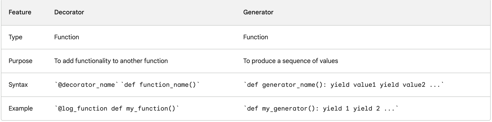

A decorator is a function that takes another function as an argument and returns a modified version of the function. Decorators are often used to add functionality to functions, such as logging, timing, or error handling.

```
def log_function(func):
  def wrapper(*args, **kwargs):
    print("Calling function:", func.__name__)
    result = func(*args, **kwargs)
    print("Function returned:", result)
    return result
  return wrapper

@log_function
def my_function(x, y):
  return x + y

print(my_function(1, 2))
```

A generator is a function that produces a sequence of values, one at a time. Generators are created using the yield keyword. Generators are useful for a variety of tasks, such as filtering a sequence of values, transforming a sequence of values, or iterating over a large sequence of values without storing the entire sequence in memory.

```
def read_file(filename):
  with open(filename, 'r') as f:
    for line in f:
      yield line

for line in read_file('my_file.txt'):
  print(line)
```




## More usecases

### timeit 

```
def timeit(func):
    def wrapper(*args, **kwargs):
        start = time.time()
        result = func(*args, **kwargs)
        end = time.time()
        print("Time taken to execute function:", end - start)
        return result
    return wrapper

@timeit
def factorial(n):
  print("Without using cache decorator")
  return n*factorial(n-1) if n else 1 

print(factorial(5))
```


